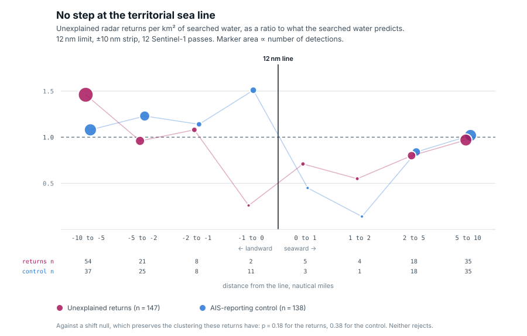
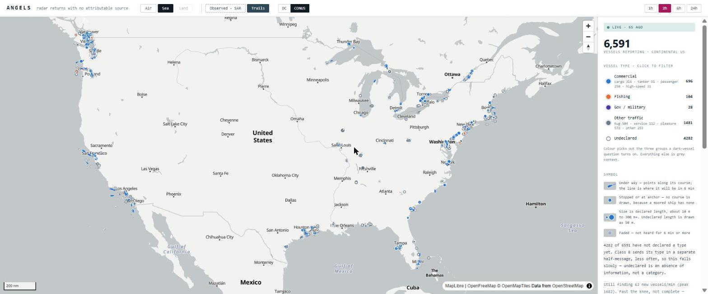
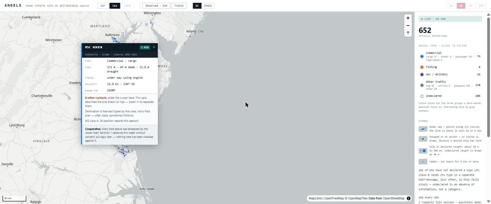

# ANGELS

**angels** *(n.)* — radar returns with no attributable source. Something is
present; the sensor cannot say what.

## The question

Almost everything we know about the movement of ships and aircraft comes from
**cooperative reporting** — the platform announces its own position, and
everyone downstream treats that announcement as fact. None of these protocols
authenticate. Every one can be switched off, spoofed, or given someone else's
identity, and the infrastructure keeps believing it.

Against that sits **independent sensing**: instruments that observe whether or
not the target consents. Radar satellites see hulls. Ground receiver networks
triangulate a transmitter's real position regardless of what it claims.

The intelligence product is the **discrepancy**. What the sensor saw, minus
what the subject admitted.

> **Does non-cooperative behaviour concentrate at governance discontinuities?**
> Boundaries where enforcement authority changes create incentive gradients.
> The hypothesis is that platforms go dark disproportionately near them, and
> that distance-to-boundary predicts the rate.

## The answer

**No — and the reason the naive version of the test says otherwise is the
more useful result.**

Twelve Sentinel-1 passes (S1A, relative orbit 106, 2024-04-10 to 2024-12-30,
every 24 days) yield **1,097 unexplained returns** in water where AIS
reception is measured as *heard*. Counted per km² of **searched water** and
stratified by pass, they are **depleted** near maritime limits, not
concentrated: 0.40× expected within 2 nm of any line.

Against a null that scatters candidates independently, every limit rejects at
p < 0.0005. **So does the AIS-reporting control** — χ² 80.5 against the
candidates' 80.8 on the 12 nm line. Reporting vessels are by definition not
hiding, so a statistic that flags them is measuring where ships are, not who
is dark. Against a shift null that preserves clustering, the local step test
finds nothing at either the 12 nm (p = 0.18) or the 24 nm line (p = 0.23).



Marker area is proportional to the number of detections. Every excursion far
from parity is a band holding one to five returns; every band with weight sits
near 1.0.

Stated rather than buried: the **3 nm state seaward line** (Submerged Lands
Act) is not in NOAA's Maritime Limits product and is still missing, the
**200 nm EEZ** lies outside the study box so its result is an empty cell
rather than a measured null, and no candidate has yet been read by a human.
The near-line bands hold single-digit counts, so this bounds what was looked
for rather than settling what is there.

## The live platform



Four collectors run continuously as Windows scheduled tasks under the SYSTEM
account, so collection survives logoff and reboot:

| collector | feed | cadence |
|---|---|---|
| `air` | ADS-B via OpenSky, DC–Baltimore | 30 s poll |
| `conus` | ADS-B, continental US | 10 min poll |
| `sea` | AIS via aisstream, Chesapeake–Delaware | pushed, ~175 msg/min |
| `sea-conus` | AIS, US waters | pushed, ~1,850 msg/min |

Live AIS is written in **`ais.COLUMNS`**, the MarineCadastre bulk schema, so
everything the retrospective analysis does — clipping, the reception grid, the
matcher, the boundary analysis — runs on live-collected data unchanged.

The viewer shows aircraft and vessels on two boxes each, with archive trails,
session wakes, and a hover card that separates what a contact broadcast from
what this project says about it. It renders **cooperative reporting only**,
and says so on every screen.



`angels/core/uptime.py` records that each collector was awake and asking,
separately from what came back. An hour with nothing in it is either a quiet
sea or a stopped collector, and only a record written at the time can tell
them apart — the same distinction the searched-water denominator exists to
protect.

## Architecture

```
adapters/     the only domain-specific code
    |         translate a native feed into Tracks and Observations,
    v         and supply a PlausibilityModel
core/         written once, domain-blind
    |         gaps, kinematics, identity, matching, loiter, orbits, rendezvous
    v
analysis/     spatial statistics over the resulting events
```

One rule, enforced by `tests/test_architecture.py`: **`core` never imports
`adapters`.**

The other load-bearing idea lives in `core/models.py`: a `Report` and an
`Observation` are different types. Merge them and the architecture becomes
pointless.

## Data

| source | what | licence / access |
|---|---|---|
| Sentinel-1 GRD | radar imagery, 12 passes | Copernicus, free account |
| MarineCadastre AIS | bulk historical AIS | CC0 |
| aisstream.io | live AIS | free API key |
| OpenSky Network | ADS-B state vectors | free account, credit budget |
| NOAA Maritime Limits | 12 / 24 / 200 nm lines | public domain |

Credentials go in `.env` (see `.env.example`); it is gitignored and nothing in
the repo prints a credential value.

## Reproducing the result

The point of a capstone is that someone can check it, so the four small files
the conclusion rests on and the per-scene record of what was searched are in
version control — 118 files, about 2 MB in git. The 56 GB of Sentinel-1
scenes and the 3.2 GB of reference AIS are not, and never will be.

```bash
pip install -e ".[dev]" && pip install -e ".[ml]"
python scripts/fetch_limits.py     # the only thing that needs the network
make check                         # what can run here, and what each gap needs
make reproduce                     # run it
python scripts/reproduce.py --all  # and re-run the boundary nulls (slow)
```

`--all` is the one that matters. Every stochastic step is seeded —
`boundary_analysis.py` at 20240621, the sampler and the correction at
20260925 — so a correct re-run is **byte-identical**, and the script compares
every band, every limit and every p-value against the committed
`boundary-bands.json` rather than just reporting that it finished. Without
that comparison, "ran 4, failed 0" means the pipeline executed, not that
anything reproduced.

Output goes to `data/events/reproduce/`. Nothing committed is overwritten.

What a clone **cannot** regenerate, and the script says so per stage: the
image chips and the AIS-isolation pass in the dossiers (raw scenes and 3.2 GB
of parquet), and anything upstream of the detections themselves.

## Quickstart

Python ≥ 3.11.

```bash
pip install -e ".[dev]"
pytest -q                      # offline; the suite never touches the network
```

Windows, which is where the collectors run:

```powershell
.\tasks.ps1 dev
.\tasks.ps1 test
.\app.ps1                                  # API + viewer, opens the browser
.\app.ps1 stop                             # closes the viewer; collection continues
```

### Running the collectors properly

Collection cannot be backfilled — an hour you did not collect is gone — so it
runs permanently in the background, independently of the viewer. From an
**elevated** PowerShell:

```powershell
.\collector.ps1 install-all -AsSystem      # all four, as SYSTEM
.\collector.ps1 status                     # tasks, archives, live pollers
.\collector.ps1 logs -Aoi sea              # tail one
```

`-AsSystem` is the point: a logon task stops at logoff and does not start
after a reboot until someone signs in, and the SYSTEM account needs no stored
password. The tasks restart themselves, retry every 15 minutes if they are not
running, and keep going on battery. They cannot run while the machine is
asleep — nothing fixes that, but the heartbeat log records the gap.

Note that `status` from a non-elevated window cannot read a SYSTEM-owned
task or process. It reports that it is blind rather than reporting nothing.

## Tests

Over 800 tests, and three of them decide whether the rest mean anything:

- **`test_architecture.py`** fails the build if `core` imports `adapters`, or
  if an ingest script ships without a heartbeat.
- **`conftest.py`** blocks outbound sockets. It exists because a test once
  authenticated against Copernicus for real and reported DID NOT RAISE.
- **`conftest.py`** also redirects every generated-data path to a temp tree.
  It exists because the suite began reading the running collectors, and its
  result had quietly become a function of whether they were up.

## Status

| Phase | | |
|---|---|---|
| 0 | Core model, aviation ingest, archive, map | done |
| 1 | Detectors, searched-water coverage, SAR → AIS subtraction | done |
| 2 | Maritime adapter — the generality test | done |
| 3 | Boundary analysis over 12 passes | **done — see above** |
| 4 | Live multi-domain viewer, continuous collection | done |
| 5 | Land domain (GTFS-RT), cross-domain comparison | scoped |
| 6 | Inversion classifier, chronolocation | scoped |

## Scope

Targets are **platforms and institutions, never persons** — vessels, aircraft,
facilities, organisations, and aggregate spatial patterns. That boundary is
deliberate, and the reasoning is in [`docs/architecture.md`](docs/architecture.md).

## License

MIT.
