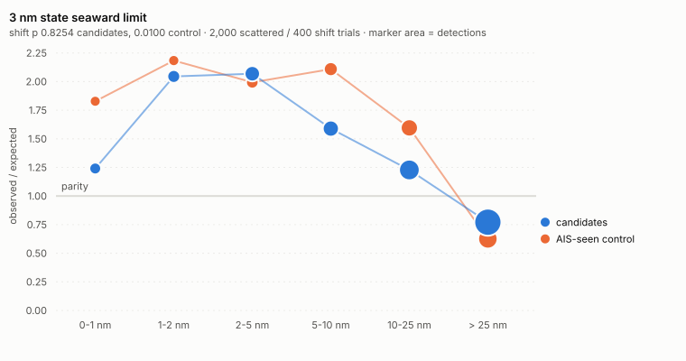
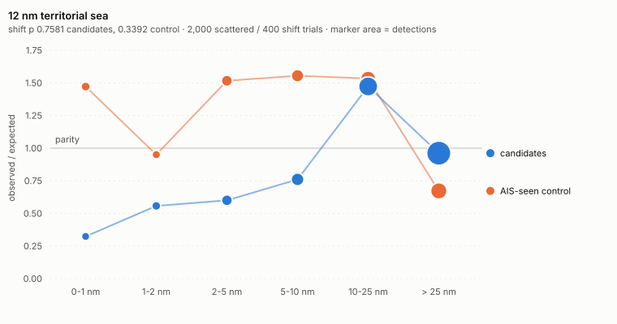
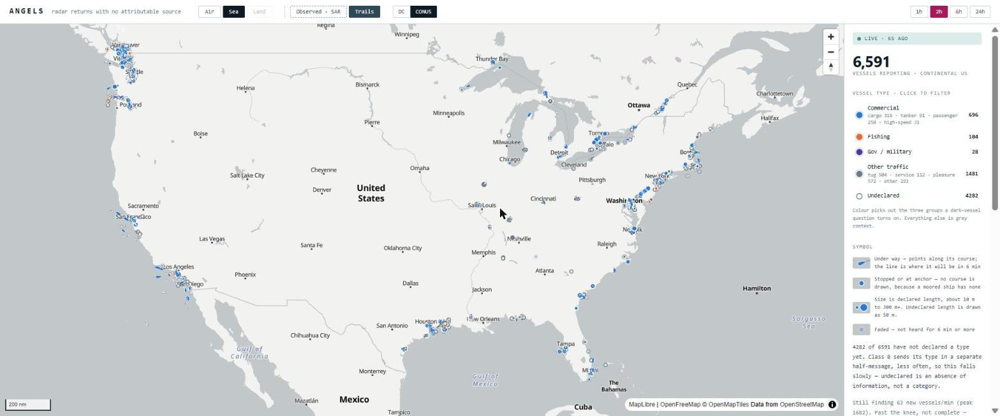
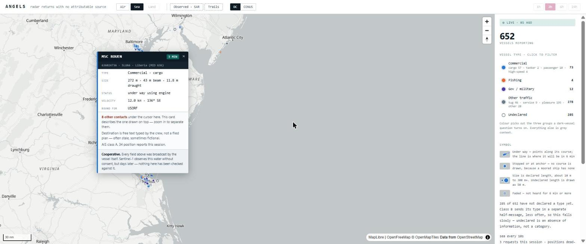

# ANGELS

**angels** *(n.)* — radar returns with no attributable source. Something is
present; the sensor cannot say what.

## The question

Almost everything we know about the movement of ships and aircraft comes from
**cooperative reporting** — the platform announces its own position, and
everyone downstream treats that announcement as fact. None of these protocols
authenticate. Every one can be switched off, spoofed, or given someone else's
identity, and the infrastructure keeps believing it.

Against that sits **independent sensing**: instruments that observe whether or
not the target consents. Radar satellites see hulls. Ground receiver networks
triangulate a transmitter's real position regardless of what it claims.

The intelligence product is the **discrepancy**. What the sensor saw, minus
what the subject admitted.

> **Does non-cooperative behaviour concentrate at governance discontinuities?**
> Boundaries where enforcement authority changes create incentive gradients.
> The hypothesis is that platforms go dark disproportionately near them, and
> that distance-to-boundary predicts the rate.

## The answer

**No. And the control is what makes that a measurement rather than a shrug.**

Twelve Sentinel-1 passes (S1A, relative orbit 106, 2024-04-10 to 2024-12-30,
every 24 days) yield **1,107 unexplained returns**, of which **1,054** sit in
water where AIS reception is measured as *heard*. Counted per km² of
**searched water** and stratified by pass, they are **depleted** near
maritime limits, not concentrated — 0.24× expected within 1 nm of any line,
0.58× at 1–2 nm, against 1.44× out at 10–25 nm.

Two nulls are run against every limit. One scatters candidates
independently; the other **shifts the whole pattern** across the study area,
preserving its clustering. Only the second is informative, and it is the one
that matters here:

| limit | χ² | scattered *p* | **shift *p*** | corrected |
|---|---:|---:|---:|---:|
| any limit (12 + 24 + 200 nm) | 118.7 | .0005 | **0.3791** | 0.6683 |
| 12 nm territorial sea | 78.8 | .0005 | **0.7581** | 0.9352 |
| 24 nm contiguous zone | 205.5 | .0005 | **0.0499** | 0.0873 |
| 3 nm state seaward limit | 145.1 | .0005 | **0.8254** | 0.7232 |
| 200 nm EEZ | — | — | — | NOT TESTED |

The scattered null rejects every limit at its floor — **and so does the
AIS-reporting control**, which is by definition not hiding. A statistic that
flags reporting ships is measuring where ships are, not who is dark. Under
the shift null nothing survives, so the clustering explains the pattern and
the lines do not.

The one marginal case, **24 nm at 0.0499**, is not a finding: that is 20 of
401 shifts, so one more crossing makes it 0.0524; it fails the clutter
correction at 0.0873, exactly as predicted in writing before it was run; and
it is one of six correlated tests of the same detections.

### The 3 nm line inverts the pattern, and that is the result



| 3 nm, obs/exp | 0–1 | 1–2 | 2–5 | 5–10 | 10–25 | >25 |
|---|---:|---:|---:|---:|---:|---:|
| candidates | 1.24 | 2.04 | 2.07 | 1.59 | 1.23 | 0.77 |
| AIS-seen control | 1.83 | 2.18 | 1.99 | 2.11 | 1.60 | 0.62 |

**The control survives the shift null and the candidates do not** —
*p* = 0.0100 against 0.8254, and 0.0125 against 0.7232 after the clutter
correction. Reporting vessels concentrate on the state line; unexplained
returns do not. That is the opposite of a hiding signal, and physically
unsurprising: 3 nm is where ports, channels, pilot boarding areas and
anchorages are, and those are thick with AIS-equipped commercial traffic.

It is also the most useful number here. A method that returns null
everywhere may simply be underpowered, and nothing inside a null can
distinguish the two. The same machinery, the same six bands and the same
searched-water denominator detect a real, shift-robust concentration in the
control — so the candidates' null is a **measured absence, not an absence of
power**, and that inference carries to the 12 and 24 nm nulls, which use the
same machinery.



Both figures are generated by `scripts/plot_bands.py` from
`data/events/boundary-bands.json`. Marker area is proportional to detection
count, because a band holding four returns and a band holding five hundred
should not read alike.

### Stated rather than buried

- The **200 nm EEZ** lies outside the study box, so every candidate falls in
  one catch-all band. `boundary_analysis.py` marks that limit set NOT TESTED
  and says why, instead of printing the *p* = 1.0000 it produces by
  construction. That is the absence of a test, not the absence of an effect.
- `"any limit"` pools the **12, 24 and 200 nm** lines — the composition it
  was pre-registered and first run with. The 3 nm line arrived afterwards and
  is reported on its own rather than folded into a pool whose *p*-value had
  already been read. The membership is frozen as `REGISTERED_ANY` in code and
  recorded in the artefact as `any_limit_composition`.
- Where there **is** a strong effect it is a **gradient, not a step**.
  Landward of both the 12 and 24 nm lines, candidates run about 5.9× expected
  against the control's 2.9×, robust to the clutter correction. But the
  discrimination sits in a catch-all bucket, the bands adjacent to the
  boundary show depletion rather than a step (0.18 and 0.49), and the control
  handles traffic density but not clutter density — which is what interior
  waters are full of.
- The near-line bands hold single-digit counts, so this bounds what was
  looked for rather than settling what is there.

**97 of the 147 chips have been read by a second human**, blind. The first
round (40 chips, simple random) gives Cohen's kappa **0.467**. The second
round found something sharper: on comparable chips the same reader's
agreement fell 26 points between sessions, so **within-reader stability is
poor and is a first-class limitation** — see
[`docs/reporting-defects.md`](docs/reporting-defects.md) and FINDINGS.

## The live platform



Four collectors run continuously as Windows scheduled tasks under the SYSTEM
account, so collection survives logoff and reboot:

| collector | feed | cadence |
|---|---|---|
| `air` | ADS-B via OpenSky, DC–Baltimore | 30 s poll |
| `conus` | ADS-B, continental US | 10 min poll |
| `sea` | AIS via aisstream, Chesapeake–Delaware | pushed, ~175 msg/min |
| `sea-conus` | AIS, US waters | pushed, ~1,850 msg/min |

Live AIS is written in **`ais.COLUMNS`**, the MarineCadastre bulk schema, so
everything the retrospective analysis does — clipping, the reception grid, the
matcher, the boundary analysis — runs on live-collected data unchanged.

The viewer shows aircraft and vessels on two boxes each, with archive trails,
session wakes, and a hover card that separates what a contact broadcast from
what this project says about it. It renders **cooperative reporting only**,
and says so on every screen.



`angels/core/uptime.py` records that each collector was awake and asking,
separately from what came back. An hour with nothing in it is either a quiet
sea or a stopped collector, and only a record written at the time can tell
them apart — the same distinction the searched-water denominator exists to
protect.

## Architecture

```
adapters/     the only domain-specific code
    |         translate a native feed into Tracks and Observations,
    v         and supply a PlausibilityModel
core/         written once, domain-blind
    |         gaps, kinematics, identity, matching, loiter, orbits, rendezvous
    v
analysis/     spatial statistics over the resulting events
```

One rule, enforced by `tests/test_architecture.py`: **`core` never imports
`adapters`.**

The other load-bearing idea lives in `core/models.py`: a `Report` and an
`Observation` are different types. Merge them and the architecture becomes
pointless.

## Data

| source | what | licence / access |
|---|---|---|
| Sentinel-1 GRD | radar imagery, 12 passes | Copernicus, free account |
| MarineCadastre AIS | bulk historical AIS | CC0 |
| aisstream.io | live AIS | free API key |
| OpenSky Network | ADS-B state vectors | free account, credit budget |
| NOAA Maritime Limits | 12 / 24 / 200 nm lines | public domain |

Credentials go in `.env` (see `.env.example`); it is gitignored and nothing in
the repo prints a credential value.

## Reproducing the result

The point of a capstone is that someone can check it, so the four small files
the conclusion rests on and the per-scene record of what was searched are in
version control — 118 files, about 2 MB in git. The 56 GB of Sentinel-1
scenes and the 3.2 GB of reference AIS are not, and never will be.

```powershell
.\tasks.ps1 dev                    # never a bare `pip` -- see below
.\tasks.ps1 ml
python scripts/fetch_limits.py     # the only thing that needs the network
make check                         # what can run here, and what each gap needs
make reproduce                     # run it
python scripts/reproduce.py --all  # and re-run the boundary nulls (slow)
```

`--all` is the one that matters. Every stochastic step is seeded —
`boundary_analysis.py` at 20240621, the sampler and the correction at
20260925 — so a correct re-run is **byte-identical**, and the script compares
every band, every limit and every p-value against the committed
`boundary-bands.json` rather than just reporting that it finished. Without
that comparison, "ran 4, failed 0" means the pipeline executed, not that
anything reproduced.

Output goes to `data/events/reproduce/`. Nothing committed is overwritten.

**It has been run.** 2026-09-25, on the development machine: **18m 20s** for
the boundary stage and 19m 13s for the pipeline, with **all eight limits
identical to the committed result** — every band, every chi-square, every
p-value, scattered and shift, control included. The other stages are seconds:
classifier 47 s, clutter correction 2.1 s, gate 1.4 s, dossiers 2.6 s.

**Install through `tasks.ps1`, not a bare `pip`.** On the development machine
the bare command `python` is ArcGIS Pro's conda root — a Python 3.14
free-threaded build with wheels for almost nothing. `_env.ps1` and
`scripts/_bootstrap.py` both resolve the right interpreter, but neither can
protect a hand-typed `pip install`, which on 2026-09-25 went to the ArcGIS
interpreter, failed to find a cp314t wheel for duckdb, tried to compile it
and stopped on a missing `nmake`. Every extra in `pyproject.toml` therefore
has a `tasks.ps1` target, and `tests/test_tasks_targets.py` keeps the two in
parity.

What a clone **cannot** regenerate, and the script says so per stage: the
image chips and the AIS-isolation pass in the dossiers (raw scenes and 3.2 GB
of parquet), and anything upstream of the detections themselves.

## Quickstart

Python ≥ 3.11.

```bash
pip install -e ".[dev]"
pytest -q                      # offline; the suite never touches the network
```

Windows, which is where the collectors run:

```powershell
.\tasks.ps1 dev
.\tasks.ps1 test
.\app.ps1                                  # API + viewer, opens the browser
.\app.ps1 stop                             # closes the viewer; collection continues
```

### Running the collectors properly

Collection cannot be backfilled — an hour you did not collect is gone — so it
runs permanently in the background, independently of the viewer. From an
**elevated** PowerShell:

```powershell
.\collector.ps1 install-all -AsSystem      # all four, as SYSTEM
.\collector.ps1 status                     # tasks, archives, live pollers
.\collector.ps1 logs -Aoi sea              # tail one
```

`-AsSystem` is the point: a logon task stops at logoff and does not start
after a reboot until someone signs in, and the SYSTEM account needs no stored
password. The tasks restart themselves, retry every 15 minutes if they are not
running, and keep going on battery. They cannot run while the machine is
asleep — nothing fixes that, but the heartbeat log records the gap.

Note that `status` from a non-elevated window cannot read a SYSTEM-owned
task or process. It reports that it is blind rather than reporting nothing.

## Tests

Over 800 tests, and three of them decide whether the rest mean anything:

- **`test_architecture.py`** fails the build if `core` imports `adapters`, or
  if an ingest script ships without a heartbeat.
- **`conftest.py`** blocks outbound sockets. It exists because a test once
  authenticated against Copernicus for real and reported DID NOT RAISE.
- **`conftest.py`** also redirects every generated-data path to a temp tree.
  It exists because the suite began reading the running collectors, and its
  result had quietly become a function of whether they were up.

## Status

| Phase | | |
|---|---|---|
| 0 | Core model, aviation ingest, archive, map | done |
| 1 | Detectors, searched-water coverage, SAR → AIS subtraction | done |
| 2 | Maritime adapter — the generality test | done |
| 3 | Boundary analysis over 12 passes | **done — see above** |
| 4 | Live multi-domain viewer, continuous collection | done |
| 5 | Land domain (GTFS-RT), cross-domain comparison | scoped |
| 6 | Inversion classifier, chronolocation | scoped |

## Running the tests

```powershell
.\tasks.ps1 test           # Windows
make check                 # elsewhere
```

**Not `python -m pytest`.** On a machine with ArcGIS Pro installed, `python`
is its bundled 3.14t, which has neither pytest nor this project — you get
`No module named pytest` and nothing is tested. Python prints that before any
file in this repository is read, so it cannot be caught from here, only
warned about. If pytest *is* present but the project is not, the root
`conftest.py` stops the run and names the interpreter rather than letting the
suite fail module by module as though the code were broken.

## Reading chips

The labelling and review surface is served by the API, not opened from disk:

```powershell
.\tasks.ps1 serve          # then open http://127.0.0.1:8000/label.html
```

Opening `web/label.html` from a `file://` URL leaves it blank — the browser
blocks the module script that fetches the chips — so the page now says so
instead of rendering nothing.

## How this project checks itself

**Twenty-nine faults** found here share one shape: a routine reporting an
outcome its own execution did not entitle it to report, with nothing in the
output to say so. Almost none was an arithmetic error — the quantities
computed correctly. What failed was what the programs said about what they
had done.

One produced a published false finding, which was retracted rather than
deleted. One was a probe that answered "0 aircraft" every time it ran because
it read the wrong JSON key, and the *conclusion* it produced stood in the
plan for a week after the bug itself was fixed and written up — fixing an
instrument does not retract the readings it took. One was a `defaultdict` that
reported 122 aircraft while holding nothing, because key creation and value
insertion are separate steps. One was a dict comprehension that dropped a
dimension and flipped a result from refuted to not refuted, in the direction
of the hypothesis, on a control group of four. Two were committed inside the
script written to catch this class — one of them an hour after a comment in
that same file warned against it — which is the catalogue's own argument
holding up under the most awkward possible test.

The catalogue, the techniques that actually caught them, and the rules
adopted in response are in
[`docs/reporting-defects.md`](docs/reporting-defects.md). It is the most
reusable thing here, and the reason both headline results survived their own
inputs changing underneath them.

## The air domain, and why its null is worth more

Sea has both halves: AIS self-reports, Sentinel-1 observes without consent.
Land has only the cooperative half built. **Air was recorded for a week as
structurally incapable of the comparison** — until the probe that established
that was found to have been reading the wrong JSON key and answering
"0 aircraft" every time it ran. The retraction and the measurement that
overturned it are in
[`docs/aviation-asymmetry.md`](docs/aviation-asymmetry.md).

The maritime null has an escape hatch: **nothing obliges a vessel to report
differently at 12 or 24 nm**, so that test may simply have had no governance
to detect. Aviation closes it. Under **14 CFR 91.225(d)** ADS-B Out is
required within 30 nm of an appendix D airport from the surface to 10,000 ft
MSL, and at and above 10,000 ft everywhere in the 48 states. So below
10,000 ft the obligation *switches off* at that boundary, and above it the
obligation applies on both sides — a treatment and a control over the same
receivers, the same distance gradient and the same days.

| | inside | outside | step |
|---|---:|---:|---:|
| below 10,000 ft — obligation changes | 0.00241 | 0.00206 | −0.00035 |
| at/above 10,000 ft — control | 0.00157 | 0.00102 | −0.00055 |
| **difference in differences** | | | **+0.00020** |

**Refuted.** A displaced boundary reproduces it — shift null **359 of 400,
p = 0.8978** — and both steps are negative anyway, so the positive difference
comes only from the control falling harder. Nothing concentrates outside the
veil. The day-collapsed sensitivity gives −0.00051.

The scattered null **also** failed to reject (1,608 of 2,000, p = 0.8041),
which was not predicted. Unlike the maritime band counts, this statistic is a
difference of differences, so scattering drives both steps toward zero and
the null is centred there — the observed value is smaller than random
assignment produces 80% of the time. A stronger statement of nullity than the
shift null alone.

Three things that keep this provisional, stated rather than buried: the
independent channel is **MLAT and Mode S only** — TIS-B is excluded because
its presence rises with cooperative density faster than MLAT's, so it
correlates with the denominator ([AMENDMENT 1](docs/phase-f-prereg.md)); the
coverage mask excludes **555 of 2,296 cells** with no evidence MLAT can see
them, which is the aviation unheard water; and the window is **eight days and
7,756 independent fixes**, which is thin. The collectors keep running.

The analysis plan was committed before any statistic existed, with its prior
exposure declared, in
[`docs/phase-f-prereg.md`](docs/phase-f-prereg.md). Reproduce with
`python scripts/air_discrepancy.py`.

## Scope

Targets are **platforms and institutions, never persons** — vessels, aircraft,
facilities, organisations, and aggregate spatial patterns. That boundary is
deliberate, and the reasoning is in [`docs/architecture.md`](docs/architecture.md).

It bites hardest in the air. An airliner or a state aircraft is an
institution; a private light aircraft with its transponder off is a person
with wings. That domain has since been built, and the distinction lives in
the code and in a pre-registration rather than in this paragraph: Phase F is
constrained to aggregates -- rates per cell per band -- and no aircraft is
named in any artefact it produces. That constraint was registered before the
result existed and has not been amended since.

It bites differently on the road. The land domain includes **every vehicle,
private cars among them, as counts.** A roadside sensor or a traffic-count
layer publishes a number of vehicles and a speed for a station and an
interval; there is no identity in that record, so the boundary holds by
construction rather than by policy. Maryland's traffic layer carries a
private-car count on 2,695 of its 8,773 segments and the all-vehicles total
on the rest. What the road domain does not do is individuate: no plate
reading, and no re-identification of a private vehicle across frames or
cameras into a movement history. Institutional vehicles are treated
differently on purpose -- a bus carries a route number and is meant to be
identified.

## License

MIT.
